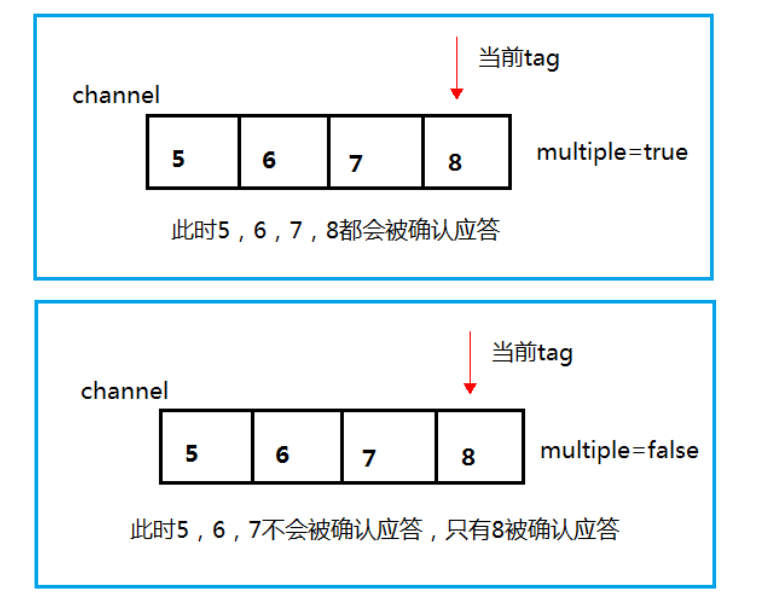
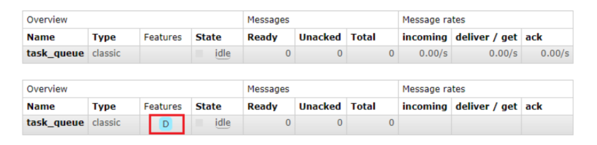
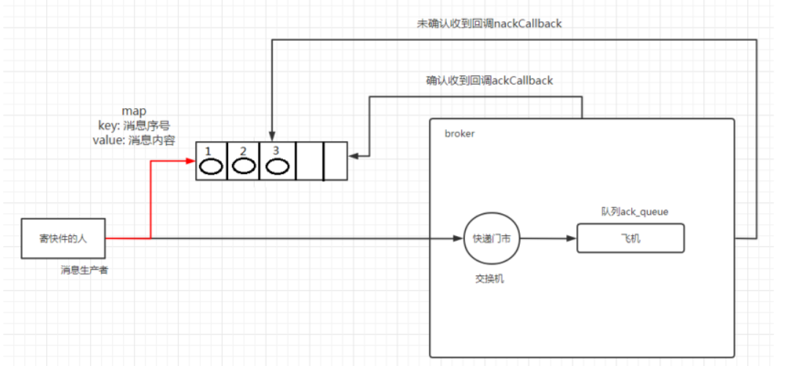
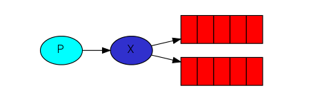
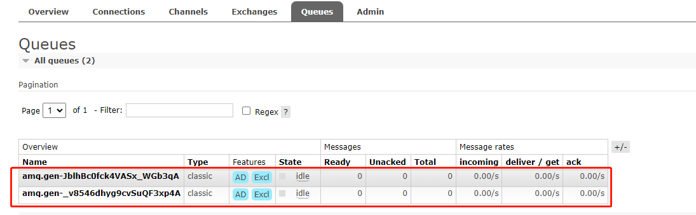
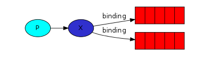
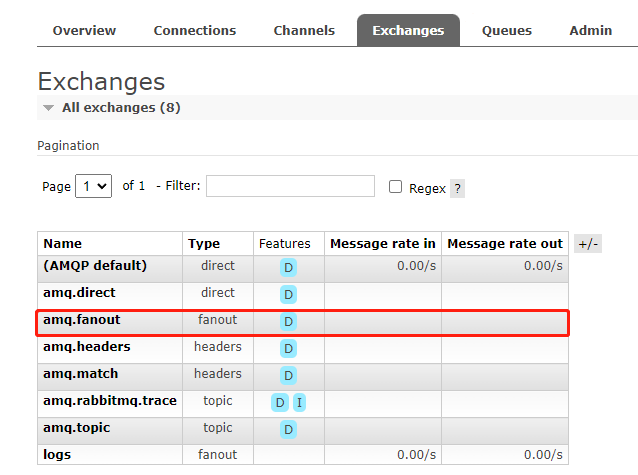
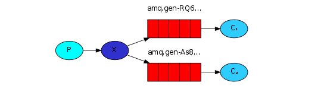

# RabbitMQ

## 1. 简介

RabbitMQ是一个消息中间件：它**接收并转发消息**。

## 2. 四大核心概念

### 2.1. 生产者

产生数据发送消息的程序是生产者

### 2.2. 交换机

交换机是RabbitMQ非常重要的一个部件，一方面它接收来自生产者的消息，另一方面它将消息推送到队列中。交换机必须确切知道如何处理它接收到的消息，是将这些消息推送到特定的队列，还是推送到多个队列，亦或是把消息弄丢，这得有个交换机类型决定

### 2.3. 队列

队列是RabbitMQ内部使用的一种数据结构，尽管消息流经RabbitMQ和应用程序，但它们只能存储在队列中。队列仅受主机的内存和磁盘限制的约束，本质上是一个大的消息缓冲区。许多生产者可以将消息发送到一个队列，许多消费者可以尝试从一个队列接收数据。

### 2.4. 消费者

消费者大多时候接是一个等待接收消息的程序。消费者生产者和消息中间件很多时候并不在同一机器上。同一个应用程序既可以是生产者又可以是消费者。

## 3. Hello World


### 3.1. 生产者

```java
public class Producer {

    private final static String QUEUE_NAME = "hello";

    public static void main(String[] args) throws IOException, TimeoutException {

        // 创建工厂
        ConnectionFactory connectionFactory = new ConnectionFactory();
        connectionFactory.setHost("123.57.133.26");
        connectionFactory.setUsername("admin");
        connectionFactory.setPassword("123");

        try (    // 创建连接
                 Connection connection = connectionFactory.newConnection();
                 // 创建信道
                 Channel channel = connection.createChannel()) {
            /**
             * 创建队列
             * 1. 队列名称
             * 2. 队列里面的程序是否持久化（磁盘） 默认在内存
             * 3. 该队列是否只提供一个消费者进行消费，true 只能一个消费者，false 可以多个消费者
             * 4. 是否自动删除，最后一个消费者断开连接后，该队列是否自动删除，true 自动删除，false 不自动删除
             * 5. 其他参数
             */
            channel.queueDeclare(QUEUE_NAME, false, false, false, null);
            // 消息
            String message = "Hello World!";
            /**
             * 发送消息
             * 1. 发送到那个交换机
             * 2. 路由的Key值，队列名
             * 3. 其他参数
             * 4. 发送的消息
             */
            channel.basicPublish("", QUEUE_NAME, null, message.getBytes(StandardCharsets.UTF_8));
        }
    }
}
```

### 3.2. 消费者

```java
public class Consumer {

    private final static String QUEUE_NAME = "hello";

    public static void main(String[] args) throws IOException, TimeoutException {
        ConnectionFactory connectionFactory = new ConnectionFactory();
        connectionFactory.setHost("123.57.133.26");
        connectionFactory.setUsername("admin");
        connectionFactory.setPassword("123");

        Connection connection = connectionFactory.newConnection();

        Channel channel = connection.createChannel();

        // 接收消息
        DeliverCallback deliverCallback = (consumerTag, message) -> {
            System.out.println("消息: " + new String(message.getBody()));
        };

        // 取消消息
        CancelCallback cancelCallback = consumerTag -> {
            System.out.println("消息消费被中断!");
        };

        /**
         * 1. 消费那个队列
         * 2. 消费成功后是否要自动应答 true 自动应答， false 手动应答
         * 3. 消费未成功的回调
         * 4. 消费者取消消费的回调
         */
        channel.basicConsume(QUEUE_NAME, true, deliverCallback, cancelCallback);
    }
}
```

## 4. Work Queues

工作队列的主要思想是避免立即执行资源密集型任务，而不得不等待它完成。相反安排任务在之后执行。把任务封装为消息并将其发送到队列。在后台运行的工作进程将弹出任务并最终执行作业。当有多个工作线程时，这些工作线程将一起处理这些任务。


### 4.1. 轮训分发消息

#### 4.1.1. 生产者

```java
public class Task01 {

    private final static String QUEUE_NAME = "hello";

    public static void main(String[] args) throws IOException {
        Channel channel = RabbitMqUtil.getChannel();

        channel.queueDeclare(QUEUE_NAME, false, false, false, null);
        
        Scanner scanner = new Scanner(System.in);
        while (scanner.hasNext()) {
            String message = scanner.next();
            channel.basicPublish("", QUEUE_NAME, null, message.getBytes(StandardCharsets.UTF_8));
        }
    }
}
```

#### 4.1.2. 消费者

```java
public class Work01 {

    private final static String QUEUE_NAME = "hello";

    public static void main(String[] args) throws IOException {
        Channel channel = RabbitMqUtil.getChannel();

        DeliverCallback deliverCallback = (consumerTag, message) -> {
            System.out.println("消息：" + new String(message.getBody()));
        };

        CancelCallback cancelCallback = consumerTag -> {

        };

        System.out.println("C1 等待消息...");
        channel.basicConsume(QUEUE_NAME, true, deliverCallback, cancelCallback);
    }

}
```

```java
public class Work02 {

    private final static String QUEUE_NAME = "hello";

    public static void main(String[] args) throws IOException {
        Channel channel = RabbitMqUtil.getChannel();

        DeliverCallback deliverCallback = (consumerTag, message) -> {
            System.out.println("消息：" + new String(message.getBody()));
        };

        CancelCallback cancelCallback = consumerTag -> {

        };

        System.out.println("C2 等待消息...");
        channel.basicConsume(QUEUE_NAME, true, deliverCallback, cancelCallback);
    }

}
```

### 4.2. 消息应答

#### 4.2.1. 概念

消费者完成一个任务需要一段时间，如果其中一个消费者处理一个长的任务并且仅完成了一部分就挂掉了，将会丢失正在处理的消息。、

#### 4.2.2. 自动应答

消息发送后立即被认为已经传送成功，这种模式需要在**高吞吐量和数据传输安全性方面做权衡**，这种模式在接收到消息之前，消费者那边出现连接或channel关闭，那么消息就会丢失，另一方面这种方式消费者那边可以传递过载的消息，没有对传递的消息数量进行限制，但这样有可能使得消费者由于接收太多来不及处理的消息，导致这些消息的积压，最终使得内存耗尽，最终这些消费者线程被操作系统杀死，所以这种模式**仅适用在消费者可以高效并以某种速率能够处理这些消息的情况下使用**。

#### 4.2.3. 消息应答的方法

**channel.basicAck()**：用于肯定确认

**channel.basicNack()**：用于否定确认

**channel.basicReject()**：用于否定确认，与basicNack()相比少了一个参数，不处理该消息直接拒绝

#### 4.2.4. Multiple 的解释

**手动应答的好处是可以批量应答并且减少网络拥堵**

```java
channel.basicAck(message.getEnvelope().getDeliveryTag(), false);
```

multiple的`true`和`false`代表不同意思

​	`true`：代表批量应答channel上未应答的消息

​			比如channel上有传送tag得消息 5, 6, 7, 8 当前tag = 8，那么此时5-8的这些还未应答的消息都会被确认收到消息应答

​	`false`：同 true 相比，只会应答 tag = 8 的消息， 5, 6, 7 这三个消息依然不会被确认消息收到消息应答



#### 4.2.5. 消息自动重新入队

如果消费者由于某种原因失去连接，导致消息为发送`ack`确认，RabbitMQ将了解到的消息未完全处理，并将其重新排队。如果此时其他消费者可以处理，它将很快将其 分配给另一个消费者。这样，即使某个消费线程死亡，也可以确保不会丢失任何信息。

#### 4.2.6. 消息手动应答

默认采用自动应答，所以想要实现消息消费过程中不丢失，需要把自动应答改为手动应答。

##### 4.2.6.1. 生产者

```java
public class Task02 {
    public static void main(String[] args) throws IOException {
        Channel channel = RabbitMqUtil.getChannel();
        channel.queueDeclare(RabbitMqUtil.QUEUE_NAME, false, false, false, null);

        Scanner scanner = new Scanner(System.in);
        while (scanner.hasNext()) {
            String message = scanner.next();
            // 设置生产者发送消息为持久化消息（要求保存到磁盘上） MessageProperties.PERSISTENT_TEXT_PLAIN
            channel.basicPublish("", RabbitMqUtil.QUEUE_NAME, null, message.getBytes(StandardCharsets.UTF_8));
            System.out.println("发送的消息: " + message);
        }
    }
}
```

##### 4.2.6.2. 消费者

```java
public class Work03 {

    public static void main(String[] args) throws IOException {
        Channel channel = RabbitMqUtil.getChannel();
        DeliverCallback deliverCallback = (consumerTag, message) -> {
            try {
                Thread.sleep(5000);
                System.out.println("接收到的消息：" + new String(message.getBody()));
                /**
                 * 手动应答
                 * 1. 消息的标记
                 * 2. 是否批量应答    true 批量，false 不批量
                 */
                channel.basicAck(message.getEnvelope().getDeliveryTag(), false);
            } catch (InterruptedException e) {
                throw new RuntimeException(e);
            }
        };

        CancelCallback cancelCallback = consumerTag -> {};

        System.out.println("C3 等待消息处理时间较短");

        // 手动应答
        channel.basicConsume(RabbitMqUtil.QUEUE_NAME, false, deliverCallback, cancelCallback);
    }
}
```

```java
public class Work04 {
    public static void main(String[] args) throws IOException {
        Channel channel = RabbitMqUtil.getChannel();
        DeliverCallback deliverCallback = (consumerTag, message) -> {
            try {
                Thread.sleep(30000);
                System.out.println("接收到的消息：" + new String(message.getBody()));
                
                // 手动应答
                channel.basicAck(message.getEnvelope().getDeliveryTag(), false);
                
            } catch (InterruptedException e) {
                throw new RuntimeException(e);
            }
        };

        CancelCallback cancelCallback = consumerTag -> {};
        
        System.out.println("C4 等待消息处理时间较长");

        // 手动应答
        channel.basicConsume(RabbitMqUtil.QUEUE_NAME, false, deliverCallback, cancelCallback);
    }
}
```

### 4.3. 持久化

#### 4.3.1. 概念

默认情况下RabbitMQ退出或由于某种原因崩溃时，它将忽视队列和消息。确保消息不会丢失需要做两件事: **将队列和消息都标记为持久化**

### 4.3.2. 队列持久化

将声明队列的时候吧`durable`参数设置为`true`

```java
channel.queueDeclare(RabbitMqUtil.QUEUE_NAME, true, false, false, null);
```

> 如果之前声明的不是持久化，需要把原来的队列先删除，或者重新创建一个持久化的队列，不然会报错

持久化与非持久化的区别




### 4.3.3. 消息持久化

需要在消费者修改代码

```java
// 设置生产者发送消息为持久化消息（要求保存到磁盘上） MessageProperties.PERSISTENT_TEXT_PLAIN
channel.basicPublish("", RabbitMqUtil.QUEUE_NAME, MessageProperties.PERSISTENT_TEXT_PLAIN, message.getBytes(StandardCharsets.UTF_8));
```

> 将消息标记为持久化并不能完全保证不会丢失消息。尽管它告诉RabbitMQ将消息保存到磁盘，但是这里依然存在当消息刚准备存储在磁盘的时候，消息还在缓存的一个间隔点，此时并没有真正写入磁盘。持久性保证并不强，对于简单队列而言，这已经绰绰有余。

### 4.3.4. 不公平分发

轮训分发在某些场景下并不是很好，比方说有两个消费者在处理任务，其中一个消费者处理速度非常快，另一个非常慢，这个时候轮训分发就会导致快的消费者空闲很久。

为了避免这种情况，我们可以设置参数来按劳分配

```java
channel.basicQos(1);
```

如果所有消费者都没有完成任务，队列还在不断添加新任务，队列有可能会遇到被撑满的情况，这个时候只能添加新的消费者或者改变其它存储任务的策略

### 4.3.5. 预取值

消息的发送是异步的，所以任何时候channel上肯定不止只有一个消息，消费者的手动确认也是异步的。因此就存在一个未确认的消息缓冲区，因此希望能**限制此缓冲区的大小，以避免缓冲区里无限制的未确认消息问题**。这个时候就可以通过`basicQos()`方法设置预取计数值来完成。**该值定义通道上允许未确认消息的最大数量**。一旦数量达到配置的数量，RabbitMQ将停止在通道上传递更多消息，除非至少有一个未处理的消息被确认。消息应答和Qos预取值对用户吞吐量有重大影响。通常，**增加预取值将提高向消费者传递消息的速度**。**自动应答传输效率最佳，但这种情况下已传递但未处理的消息数量也会增加，从而增加了消费者的RAM消耗**。

## 5. 发布确认

### 5.1. 发布确认原理

生产者将信道设置成`confirm`模式，一旦进入confirm模式，所有在该信道上面发布的消息都将会被指派一个唯一ID(从1开始)，一旦消息被投递到所有匹配的队列之后，broker就会发送一个确认给生产者（包含消息的唯一ID）。如果消息和队列是可持久化的，那么确认消息会将消息写如此盘后出发，broker回传给生产者的确认消息中，delivery-tag域包含了确认消息的序列号，此外broker也可以设置`basicAck()`的`multiple`域，表示这个序号之前的所有消息已经得到了处理。

### 5.2. 发布确认的策略

### 5.2.1. 开启发布确认方法

发布确认默认不开启，使用发布确认模式，需要在channel上调用该方法

```java
// 开启确认模式
channel.confirmSelect();
```

### 5.2.2. 单个确认

发布一个消息之后只有它被确认发布，后续的消息才能继续发布，`waitForConfirmsOrDie(long)`方法只有消息被确认时才能返回，如果指定时间内这个消息没有被确认，将会抛出异常。单个确认最大缺点就是发布速度特别慢，因为如果没有确认发布的消息就会阻塞所有后续消息的发布，这种方式最多提供每秒不超过数百条发布消息的吞吐量。

```java
/**
 * 单个确认模式
 */
public static void publishMessageIndividually() throws IOException, InterruptedException {
    Channel channel = RabbitMqUtil.getChannel();
    // 队列
    String queueName = UUID.randomUUID().toString();
    channel.queueDeclare(queueName, true, false, false, null);
    // 开启确认模式
    channel.confirmSelect();
    // 开始时间
    long start = System.currentTimeMillis();
    for (int i = 1; i <= NUM; i++) {
        String message = "Hello World - " + i;
        channel.basicPublish("", queueName, MessageProperties.PERSISTENT_TEXT_PLAIN, message.getBytes(StandardCharsets.UTF_8));
        // 单个确认
        boolean flag = channel.waitForConfirms();
        if (flag) {
            System.out.println("消息发送成功: " + message);
        }
    }
    // 结束时间
    long end = System.currentTimeMillis();

    System.out.println("发送" + NUM + "个消息耗时: " + (end - start) + "毫秒");
}
```

### 5.2.3. 批量确认

与单个确认相比，先发布一批消息，然后一起确认可以及大的提高吞吐量，当然这种方式的缺点就是：当发生故障时，不知道是哪个消息出现了问题，我们必须将整个批处理保存在内存中，以记录重要的信息后重新发布消息。这种方案仍然是同步的，也一样阻塞消息的发布。

```java
/**
 * 批量确认
 */
public static void publishMessageBatch() throws IOException, InterruptedException {
    Channel channel = RabbitMqUtil.getChannel();
    // 队列
    String queueName = UUID.randomUUID().toString();
    channel.queueDeclare(queueName, true, false, false, null);
    // 开启确认模式
    channel.confirmSelect();
    // 开始时间
    long start = System.currentTimeMillis();

    // 批量确认消息大小
    int batchSize = 100;

    for (int i = 1; i <= NUM; i++) {
        String message = "Hello World - " + i;
        channel.basicPublish("", queueName, MessageProperties.PERSISTENT_TEXT_PLAIN, message.getBytes(StandardCharsets.UTF_8));
        // 到达100 批量确认一次
        if (i % batchSize == 0) {
            // 单个确认
            boolean flag = channel.waitForConfirms();
            if (flag) {
                System.out.println("消息发送成功: " + message);
            }
        }
    }

    // 结束时间
    long end = System.currentTimeMillis();

    System.out.println("发送" + NUM + "个消息耗时: " + (end - start) + "毫秒");
}
```

### 5.2.4. 异步确认

异步确认比单个确认与批量确认复杂，但无论可靠性还是效率都最好，它是利用回调函数来达到消息可靠性传递的，这个中间件也是通过函数回调来保证是否投递成功。



```java
/**
 * 异步确认
 */
public static void publishMessageAsynchronous() throws IOException {
    Channel channel = RabbitMqUtil.getChannel();
    // 队列
    String queueName = UUID.randomUUID().toString();
    channel.queueDeclare(queueName, true, false, false, null);
    // 开启确认模式
    channel.confirmSelect();
    // 开始时间
    long start = System.currentTimeMillis();

    // 准备消息监听器，监听哪些成功哪些失败
    // 监听成功
    ConfirmCallback ackCallback = (deliveryTag, multiple) -> {
        System.out.println("已确认的消息: " + deliveryTag);
    };
    /**
     * 监听失败
     * 1. 消息的标记
     * 2. 是否为批量的确认
     */
    ConfirmCallback nackCallback = (deliveryTag, multiple) -> {
        System.out.println("未确认的消息: " + deliveryTag);
    };
    // 异步通知
    channel.addConfirmListener(ackCallback, nackCallback);

    for (int i = 1; i <= NUM; i++) {
        String message = "Hello World - " + i;
        channel.basicPublish("", queueName, MessageProperties.PERSISTENT_TEXT_PLAIN, message.getBytes(StandardCharsets.UTF_8));
    }

    // 结束时间
    long end = System.currentTimeMillis();

    System.out.println("发送" + NUM + "个消息耗时: " + (end - start) + "毫秒");
}
```

### 5.2.5. 处理异步未确认消息

最好的解决方案就是把未确认的消息放在一个基于内存的能被发布线程访问的队列。比如用`ConcurrentLinkedQueue`队列在confirm callbacks与发布线程之间进行消息的传递。

## 6. 交换机
工作队列将每个消息都交付给一个消费者，在 "发布/订阅" 模式中，将消息传达给多个消费者
### 6.1. Exchanges
#### 6.1.1. 概念
RabbitMQ消息传递模型的核心思想是：**生产者生产的消息不会直接发送到队列**。实际上，通常生产者都不知道这些消息传递到了哪些队列
**生产者只能将消息发送到交换机**，交换机一方面接收来自生产者的消息，另一方面将他们推入队列。交换机必须确切的知道如何处理收到的消息，是应该把这些消息放到特定队列还是放到许多队列还是应该丢弃它们。这由交换机来决定。



#### 6.1.2. Exchanges的类型
- 直接 (direct)
- 主题 (topic)
- 标题 (headers)
- 扇出 (fanout)

#### 6.1.3. 无名Exchanges
无名Exchanges就是默认交换机，通过空字符串进行标识
```java
/** 
* 发送消息 
* 1. 发送到那个交换机
* 2. 路由的Key值，队列名
* 3. 其他参数 
* 4. 发送的消息
*/
channel.basicPublish("", queueName, null, message.getBytes(StandardCharsets.UTF_8));
```

消息路由发送到队列中其实是由`routingKey(bindingKey)`绑定`key`指定的

### 6.2. 临时队列
当连接到RabbitMQ时，需要一个全新的空队列，为此可以创建一个具有**随机名称的队列**，或者能让服务器选择一个随机队列名称就好了。**一旦我们断开了消费者的连接，队列将会被删除**

创建队列的方式：

```java
String queueName = channel.queueDeclare().getQueue();
```



### 6.3. 绑定 (Bindings)

`binding`其实就是`exchange`和`queue`之间的桥梁，它告诉了exchange 和 那个queue 进行了绑定关系。




### 6.4. Fanout

#### 6.4.1. Fanout介绍
Fanout类型将它接收到的所有消息**广播**到它所知道的所有队列。系统中默认有些exchange类型



#### 6.4.2. Fanout实战



##### 6.4.2.1. 生产者

```java
public class EmitLog {

    private final static String EXCHANGE_NAME = "logs";

    public static void main(String[] args) throws IOException {

        Channel channel = RabbitMqUtil.getChannel();
        channel.exchangeDeclare(EXCHANGE_NAME, "fanout");

        Scanner scanner = new Scanner(System.in);

        while (scanner.hasNext()) {
            String message = scanner.next();
            channel.basicPublish(EXCHANGE_NAME, "", null, message.getBytes(StandardCharsets.UTF_8));
            System.out.println("EmitLog发出消息: " + message);
        }

    }

}
```

##### 6.4.2.2. 消费者

```java
public class ReceiveLog01 {

    private final static String EXCHANGE_NAME = "logs";

    public static void main(String[] args) throws IOException {
        Channel channel = RabbitMqUtil.getChannel();
        /*
          声明交换机
          1. 交换机名称
          2. 交换机类型
         */
        channel.exchangeDeclare(EXCHANGE_NAME, "fanout");
        /*
           声明一个临时队列
           消费者与队列断开时，自动删除
         */
        String queue = channel.queueDeclare().getQueue();
        /*
          绑定交换机与队列
          1. 队列名
          2. 交换机名
          3. routingKey
         */
        channel.queueBind(queue, EXCHANGE_NAME, "");
        System.out.println("等待接收消息...");

        // 接收消息
        DeliverCallback deliverCallback = (consumerTag, message) -> {
            System.out.println("ReceiveLog01接收消息: " + new String(message.getBody()));
        };

        // 取消消息
        CancelCallback cancelCallback = consumerTag -> {

        };

        channel.basicConsume(queue, true, deliverCallback, cancelCallback);
    }
}
```

```java
public class ReceiveLog02 {

    private final static String EXCHANGE_NAME = "logs";

    public static void main(String[] args) throws IOException {
        Channel channel = RabbitMqUtil.getChannel();
        /*
          声明交换机
          1. 交换机名称
          2. 交换机类型
         */
        channel.exchangeDeclare(EXCHANGE_NAME, "fanout");
        /*
           声明一个临时队列
           消费者与队列断开时，自动删除
         */
        String queue = channel.queueDeclare().getQueue();
        /*
          绑定交换机与队列
          1. 队列名
          2. 交换机名
          3. routingKey
         */
        channel.queueBind(queue, EXCHANGE_NAME, "");
        System.out.println("等待接收消息...");

        // 接收消息
        DeliverCallback deliverCallback = (consumerTag, message) -> {
            System.out.println("ReceiveLog02接收消息: " + new String(message.getBody()));
        };

        // 取消消息
        CancelCallback cancelCallback = consumerTag -> {

        };

        channel.basicConsume(queue, true, deliverCallback, cancelCallback);
    }
}
```