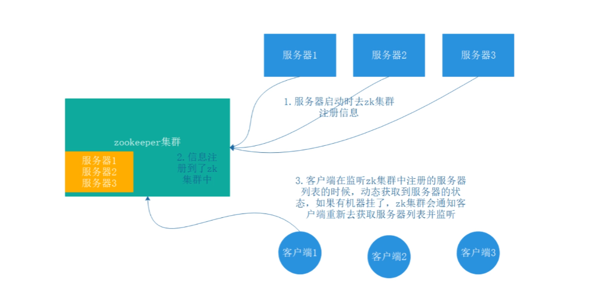
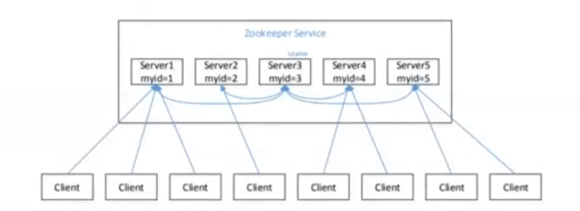

# Zookeeper

## 1. 简介

Zookeeper是一个分布式的，开源的分布式应用程序协调服务，从设计模式角度来理解的话就是一个基于观察者模式设计的分布式服务管理框架。即，**管着一些数据，这些数据变化的时候要给观察者提供响应。**

它是一个为分布式应用提供一致性服务的软件，提供的功能包括：==统一命名服务==、==统一配置管理==、==统一集群管理==、==服务节点动态上下线==、==软负载均衡==等。

## 2. 内部原理

### 2.1. 选举机制

**半数机制：**集群中半数以上机器alive则集群可用。所以Zookeeper更适合装在奇数台机器上（容忍度：奇数台和偶数台的容忍度是一样的。3:1，4:1）。并且不同于其它框架的主从机制，Zookeeper并没有配置文件中界定leader和follower的具体对象，而是在集群启动的时候通过内部选举的方式临时产生一个leader。

Server一共有如下三种状态:

- `LOOKING`：当前Server不知道leader是谁，正在搜寻

- `LEADING`：当前Server即为选举出来的leader
- `FOLLOWING`：leader已经选举出来，当前Server与之同步

1. 服务器1启动，此时只有一台服务器启动了，它发出去的报文没有任何响应，所以选举状态为LOOKING。
2. 服务器2启动，它与1服务器进行通信，互相交换自己的选举结果，由于两者都没有历史数据zxid，所以myid最大的服务器2胜出，但是由于没有达到超过半数以上的服务器都同意选举它，所以服务器1,2还是继续保持LOOKING状态。
3. 服务器3启动，根据前边的分析，最终服务器3成为leader
4. 服务器4启动，根据前边的分析，理论上服务器4应该是最大的，但是由于前面已经有半数以上的服务器选举了3，所以它也只能FOLLOWING
5. 服务器5同4一样

### 2.2.Paxos

**Paxos**，是一个基于消息传递的一致性算法，只有在一个可信的计算机环境中才能成立，这个环境是不会被入侵所破坏的。